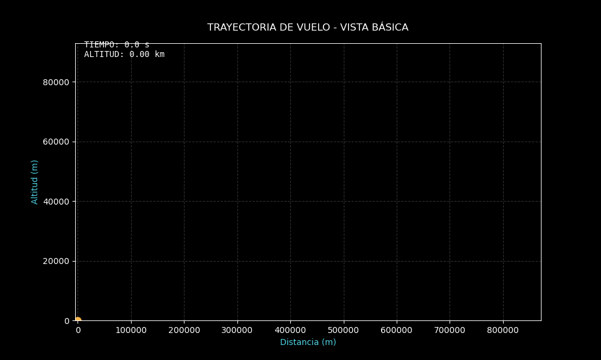

# gemini-sciml-rocket-sim 🚀
### High-Fidelity Synthetic Data Factory for Physics-Informed Neural Networks (PINNs)


---

## 📌 Project Vision

**gemini-sciml-rocket-sim** is a robust simulation environment designed to generate "Ground Truth" datasets for **Scientific Machine Learning (SciML)**. By integrating high-precision numerical methods with AI-driven auditing, this project provides a complete pipeline for creating synthetic telemetry that strictly adheres to physical laws. 

It is specifically tailored to provide training data for **Physics-Informed Neural Networks (PINNs)**, where the loss function incorporates the residuals of the governing differential equations.

---

## 🎥 Mission Visualization

The project includes two visualization tiers to validate trajectory dynamics and physical consistency.

| **Basic Trajectory Analysis** | **Advanced Physical Validation (SciML)** |
|:---:|:---:|
|  |  |
| *Clean engineering view focusing on downrange vs. altitude. Ideal for rapid trajectory auditing.* | *High-fidelity HUD with real-time Force Vectors (Thrust, Drag, Gravity) and Mach telemetry.* |

---

## 🏗️ Architecture & Data Pipeline

The project implements a **Simulation-to-Insight** workflow:

1.  **Numerical Engine (`motor_integracion.py`):** Custom 4th-order Runge-Kutta (RK4) solver for high-precision time integration of non-linear ODEs.
2.  **Physics Simulator (`simulador.py`):** Multi-stage rocket dynamics featuring barometric drag modeling and gravity turn maneuvers.
3.  **Data Generation:** Outputs high-resolution CSV telemetry ($x, y, v_x, v_y, m$).
4.  **AI Audit (Gemini CLI):** Automated engineering reasoning to analyze Delta-v efficiency and energy loss through natural language interaction with physical data.

---

## 🧠 Mathematical Framework

The system solves a coupled set of five first-order non-linear Ordinary Differential Equations (ODEs).

### State Vector
The state of the vehicle at any time $t$ is defined by:
$$\mathbf{u}(t) = [x, y, v_x, v_y, m]^T$$

### Governing Equations (Equations of Motion)
The dynamics are governed by the following system, accounting for variable mass and external forces:

$$
\frac{d}{dt} \begin{bmatrix} x \\ y \\ v_x \\ v_y \\ m \end{bmatrix} = 
\begin{bmatrix} 
v_x \\ 
v_y \\ 
\frac{T(t) \cos(\theta)}{m} + \frac{F_{d,x}}{m} \\ 
\frac{T(t) \sin(\theta)}{m} - g + \frac{F_{d,y}}{m} \\ 
-\dot{m}_{rate}(t) 
\end{bmatrix}
$$

### Atmospheric & Propulsion Models
*   **Variable Mass:** Thrust ($T$) and mass flow ($\dot{m}$) follow a multi-stage logic with separation occurring at $t = 150s$.
*   **Atmospheric Drag:** Modeled using a dynamic air density $\rho(y)$ based on the barometric formula:
    $$\rho(y) = \rho_0 e^{-\frac{y}{H_{scale}}}$$
    $$\mathbf{F}_d = -\frac{1}{2} \rho(y) \|\mathbf{v}\|^2 C_d A \frac{\mathbf{v}}{\|\mathbf{v}\|}$$
*   **Gravity Turn:** The pitch angle $\theta$ is actively modulated to gain horizontal velocity and minimize gravity losses.

---

## 🧬 Why SciML & PINNs?

Unlike black-box models, **Physics-Informed Neural Networks (PINNs)** utilize the differential equations above as a regularization term. This repository provides:
1.  **Labeled Data:** For the $\mathcal{L}_{data}$ term of the loss function.
2.  **Physical Constraints:** The explicit ODEs defined in `simulador.py` serve as the $\mathcal{L}_{physics}$ constraint, ensuring the neural network's predictions remain within the bounds of reality.

---

## 🛠️ Usage

Execute the unified pipeline to generate datasets and AI-driven technical reports:

```bash
chmod +x generar_reporte.sh
./generar_reporte.sh
```

### Outputs:
*   `trayectoria.gif`: Basic visual audit.
*   `validacion_fisica_sciml.gif`: Advanced physical telemetry validation.
*   `datos_orbitales.csv`: High-resolution synthetic dataset.
*   `reporte_vuelo.md`: AI-generated mission analysis.

---

**Jefferson Conza**  
*Mathematics Student | ML Engineer*
